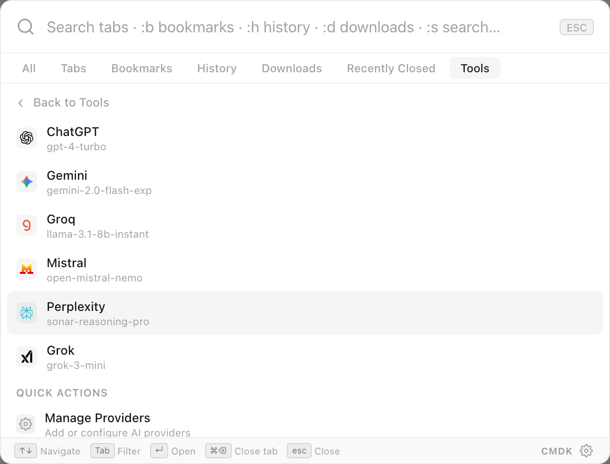

We're excited to introduce **TabCmdr** — a fast, keyboard-driven command palette for your browser.

## What is TabCmdr?

TabCmdr brings the productivity of tools like macOS Spotlight or VS Code's command palette directly into your browser. Press your shortcut and instantly:

- Switch between open tabs
- Search and open bookmarks
- Run page-level commands
- Browse your history
- Manage downloads and tab groups

## Why we built it

Browser navigation is slow. You click through menus, scroll through tab bars, and dig through bookmark folders. TabCmdr replaces all of that with a single keyboard-driven interface.

## Get started

Check out the [documentation](/docs/getting-started) to install TabCmdr and configure it to your workflow.
